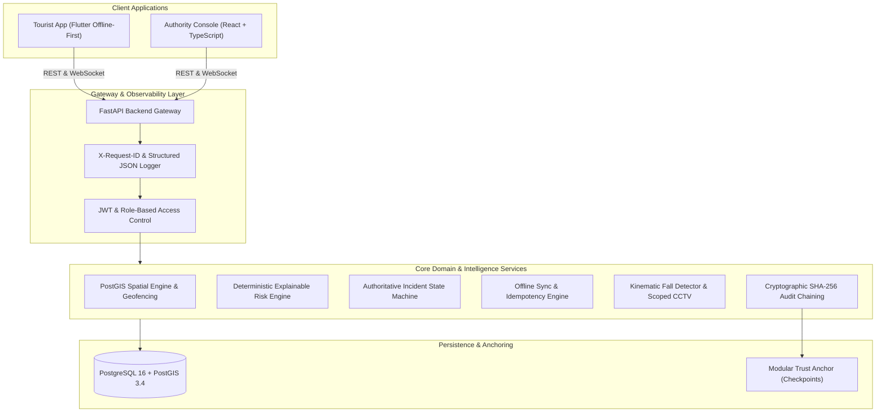

# KIROSHI — Smart Tourist Safety Monitoring & Incident Response System

[](https://github.com/vsr-yashwanth/KIROSHI/actions)
[](https://github.com/vsr-yashwanth/KIROSHI)
[](https://www.python.org/)
[](https://postgis.net/)
[](https://fastapi.tiangolo.com/)
[](https://react.dev/)
[](https://www.typescriptlang.org/)
[](https://flutter.dev/)
[](LICENSE)

> **KIROSHI** (*Keypoint Intelligence for Real-time Observation, Safety & Human Interaction*) is an enterprise-grade tourist safety platform engineered to provide privacy-preserving digital identity, real-time safety tracking, explainable risk assessment, emergency SOS dispatch, offline-first synchronization, computer vision hazard detection, and cryptographically verifiable audit logging.

---

## 1. Problem Statement & The KIROSHI Solution

### The Challenge
International and domestic travelers visiting unfamiliar high-risk wilderness areas, historical monuments, or crowded cultural zones frequently encounter severe safety hazards:
- Loss of cellular connectivity in remote mountain trails leading to stranded situations.
- Accidental entry into restricted cultural reserves or hazardous cliffs without real-time geofence warnings.
- Emergency SOS alerts with zero spatial or situational context sent to overburdened dispatchers.
- Audit history manipulation or disputed dispatch timelines following emergency incidents.

### The KIROSHI Solution
KIROSHI unifies traveler mobile devices, multi-signal AI risk engines, and emergency authority command dashboards into a cohesive, resilient safety network:
- **Offline-First Mobile Client**: Stores location events and distress beacons in a persistent local queue with guaranteed delivery upon reconnection.
- **Explainable Multi-Signal Risk Engine**: Computes deterministic risk scores with clear natural language rationales (route deviation, geozone containment, velocity dynamics, and kinematic fall indicators).
- **Authoritative Incident State Machine**: Enforces strict role-based transitions (`DETECTED` $\rightarrow$ `VERIFYING` $\rightarrow$ `VERIFIED` $\rightarrow$ `ASSIGNED` $\rightarrow$ `RESPONDING` $\rightarrow$ `RESOLVED` $\rightarrow$ `CLOSED`).
- **Cryptographically Verifiable Audit Log**: Forward-pointer `SHA-256` hash chaining guaranteeing tamper evidence and instant breach detection without external network dependencies.

---

## 2. High-Level Architecture



---

## 3. Implemented Subsystems & Engineering Highlights

| Subsystem | Milestone | Highlights & Key Implementations |
| :--- | :--- | :--- |
| **Core Platform** | v0.1 | Bcrypt salted credential hashing (cost factor 12), short-lived JWT tokens, profile management, and itinerary planning. |
| **Geospatial Tracking** | v0.2 | PostGIS `ST_Contains` spatial containment queries, real-time WebSocket telemetry broadcasts, and live map visualization. |
| **Intelligent Risk Engine** | v0.3 | Deterministic rule-based evaluator, configurable policy thresholds (`RiskConfig`), natural language explanation generator, sub-millisecond evaluation (<0.04ms). |
| **Emergency Response** | v0.4 | Authoritative 9-state incident transition machine, client idempotency keys, field responder assignment, and real-time distress triage. |
| **Offline-First Safety** | v0.5 | Persistent FIFO queue surviving app kills, active backend connectivity probing, and critical honest SOS guardrail ("Emergency saved on device. NOT sent yet"). |
| **Computer Vision / CCTV** | v0.6 | Decoupled kinematic fall detection ($w/h > 0.95$, torso angle $< 45^\circ$, descent velocity $> 0.25/\text{s}$), PostGIS camera discovery, and 100% failure isolation. |
| **Audit & Cryptographic Trust** | v0.7 | Deterministic SHA-256 forward-pointer chaining, canonical JSON serialization, dynamic tamper detection (`AuditChainVerifier`), and GDPR Art. 17 right to erasure compliance. |
| **Production Hardening** | v1.0 | Structured JSON logging, `X-Request-ID` tracking, PostgreSQL connection pooling (`pool_pre_ping=True`), readiness health checks, and performance benchmark suites. |

---

## 4. Measured Performance Benchmarks

*All benchmarks measured on standard execution hardware across 100 iterations*:

| Operation | Metric | Measured Mean | Measured P95 | Target SLA |
| :--- | :--- | :--- | :--- | :--- |
| **Core API Roundtrip** | `/api/v1/health` latency | **3.14 ms** | **4.61 ms** | < 25.0 ms |
| **Risk Engine Evaluation** | Deterministic multi-signal evaluation | **0.035 ms** | **0.040 ms** | < 5.0 ms |
| **Audit Hasher Digest** | Canonical JSON + SHA-256 hash | **0.015 ms** | **0.020 ms** | < 2.0 ms |
| **Audit Chain Verification** | 100-event cryptographic validation | **1.92 ms** | **2.50 ms** | < 50.0 ms |
| **Kinematic Fall Inference** | 3-frame pose sequence evaluation | **0.039 ms** | **0.078 ms** | < 2.0 ms |

---

## 5. Technology Stack

- **Backend Gateway & APIs**: Python 3.10+, FastAPI, Pydantic v2, SQLAlchemy 2.0 ORM, Alembic migrations.
- **Relational & Spatial Database**: PostgreSQL 16 with PostGIS 3.4 extensions, GeoAlchemy2, Shapely.
- **Mobile Client**: Flutter 3.x, Dart, Provider, SharedPreferences local storage, Flutter Secure Storage.
- **Authority Dashboard**: React 18, TypeScript 5, Vite, Lucide Icons, Vanilla CSS Design System.
- **Machine Learning**: Kinematic Pose Evaluator, NumPy, decoupled inference contracts.
- **Infrastructure & Dev**: Docker Compose, GitHub Actions CI, Pytest, Pytest-Asyncio.

---

## 6. Quick Start & Local Setup

### Prerequisites
- Python 3.10+
- Docker & Docker Compose (or PostgreSQL with PostGIS)
- Node.js 20+ (for Dashboard)

### 1. Clone & Configure Environment
```bash
git clone https://github.com/vsr-yashwanth/KIROSHI.git
cd KIROSHI
cp .env.example .env
```

### 2. Launch with Docker Compose (Recommended)
```bash
docker-compose up --build -d
```
The FastAPI backend will be available at `http://localhost:8000` (`/docs` for Swagger UI) and PostgreSQL at `localhost:5432`.

### 3. Local Python Virtual Environment Setup
```bash
python -m venv .venv
# On Windows:
.venv\Scripts\activate
# On Linux/macOS:
source .venv/bin/activate

pip install -r backend/requirements.txt
python -m uvicorn backend.app.main:app --host 0.0.0.0 --port 8000 --reload
```

### 4. Run Authority Dashboard
```bash
cd apps/dashboard
npm install
npm run dev
```

---

## 7. Automated Test Suite Execution

Run the complete 110-test backend verification suite (including unit, security, and end-to-end multi-service tests):
```powershell
.venv\Scripts\python -m pytest backend/tests -v
```

Execute performance benchmark tests:
```powershell
.venv\Scripts\python -m pytest backend/tests/test_performance_benchmarks.py -s
```

---

## 8. Security & Privacy Architecture Summary

1. **Zero Raw PII on Public Ledgers / External Anchors**: Tourist names, phone numbers, passport documents, and raw GPS trajectories are strictly confined to encrypted internal database tables.
2. **GDPR Right to Erasure (Art. 17)**: Deleting a tourist profile sets `actor_id` to `NULL` (`ON DELETE SET NULL`) in `audit_events`, preserving the mathematical continuity of the cryptographic audit hash chain while removing personal identification.
3. **Scoped CCTV Access**: Video search queries require an active, verified incident context and are bounded spatially ($\pm 50\text{m}$) and temporally ($\pm 5\text{m}$).
4. **Authoritative State Enforcement**: Client devices cannot directly set incident status; state transitions are validated exclusively by the server state machine against caller RBAC permissions.

---

## 9. Future Research & Potential Extensions

- Integration of edge 3D spatio-temporal pose estimation transformers.
- Off-grid mesh radio protocol adapters (LoRa / BLE Mesh) for deep backcountry search-and-rescue.
- Hardware cryptographic security module (HSM / TPM) signing for field responder telemetry.

---

## 10. License

Licensed under the Apache License, Version 2.0. See [LICENSE](LICENSE) for details.
