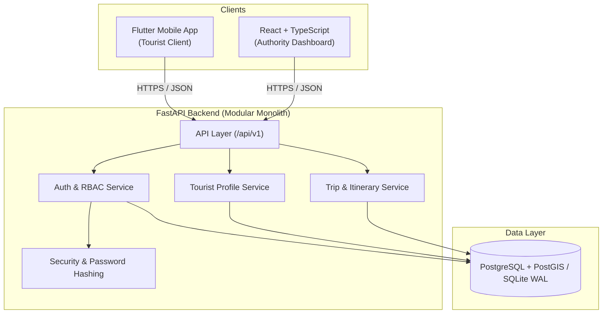

# Project Overview — KIROSHI

> Status: IMPLEMENTED (v0.1 Core Scope) | Architecture: Modular Monolith

---

## 1. Problem Statement

Tourist safety in remote, high-altitude, and unfamiliar regions presents severe logistical and technological challenges:
1. **Delayed Incident Detection**: Accidents, falls, or route disorientation often go unnoticed for hours.
2. **Fragmented Stakeholder Response**: Tourists, local police, medical responders, and tourism boards lack a unified operational picture.
3. **Data Privacy Concerns**: Traditional surveillance mechanisms often collect unencrypted personal identifying information (PII) without strict consent boundaries.
4. **Intermittent Connectivity**: Conventional cloud-only safety apps fail when mobile network coverage drops in backcountry or wilderness terrains.

---

## 2. The KIROSHI Solution

**KIROSHI** (*Keypoint Intelligence for Real-time Observation, Safety & Human Interaction*) is an integrated safety monitoring platform designed to provide:
- **Privacy-Preserving Digital Tourist Identity**: Granular consent management where sensitive PII is shielded behind server-side authorization controls.
- **Intelligent Trip Lifecycle Tracking**: Active monitoring of tourist itineraries with planned waypoints, automated status transitions, and emergency state tracking.
- **Authority Command Portal**: A streamlined web dashboard allowing verified tourism authorities to oversee active tourists, identify potential delays, and coordinate timely support.
- **Multi-Phase Intelligence Roadmap**: An engineered progression expanding from foundational data models (v0.1) to real-time geospatial geofencing (v0.2), explainable risk scoring (v0.3), multi-agency incident dispatch (v0.4), offline-first synchronization (v0.5), computer vision fall detection (v0.6), and tamper-evident audit logging (v0.7).

---

## 3. System Components

---

## 4. Current Milestone Scope (v0.1.0)

| Capability | Status | Description |
|---|---|---|
| User Registration & Login | **IMPLEMENTED** | Password hashing via bcrypt, JWT bearer token issuance. |
| Role-Based Access Control | **IMPLEMENTED** | Server-enforced roles (`TOURIST`, `AUTHORITY`, `RESPONDER`, `ADMIN`). |
| Tourist Profile Management | **IMPLEMENTED** | Emergency contacts, medical notes, consent flags, IDOR protection. |
| Trip & Itinerary Creation | **IMPLEMENTED** | Trip definition, waypoint sequencing, start/stop lifecycle. |
| Authority Oversight Portal | **IMPLEMENTED** | Web portal for inspecting active trips and authorized tourists. |
| Real-time GPS Streaming | **PLANNED (v0.2)** | WebSockets, PostGIS spatial indexing, geofence enter/exit. |
| Risk Engine | **PLANNED (v0.3)** | Anomaly detection, speed/inactivity tracking, route deviation. |
| Incident Dispatch | **PLANNED (v0.4)** | State machine incident escalation, responder assignment. |
| Offline-First Sync | **PLANNED (v0.5)** | SQLite mobile cache, store-and-forward sync queues. |
| Computer Vision | **PLANNED (v0.6)** | MediaPipe pose fall detection, CCTV search window assistance. |
| Tamper-Evident Audit | **PLANNED (v0.7)** | Cryptographically verified audit log chains. |
