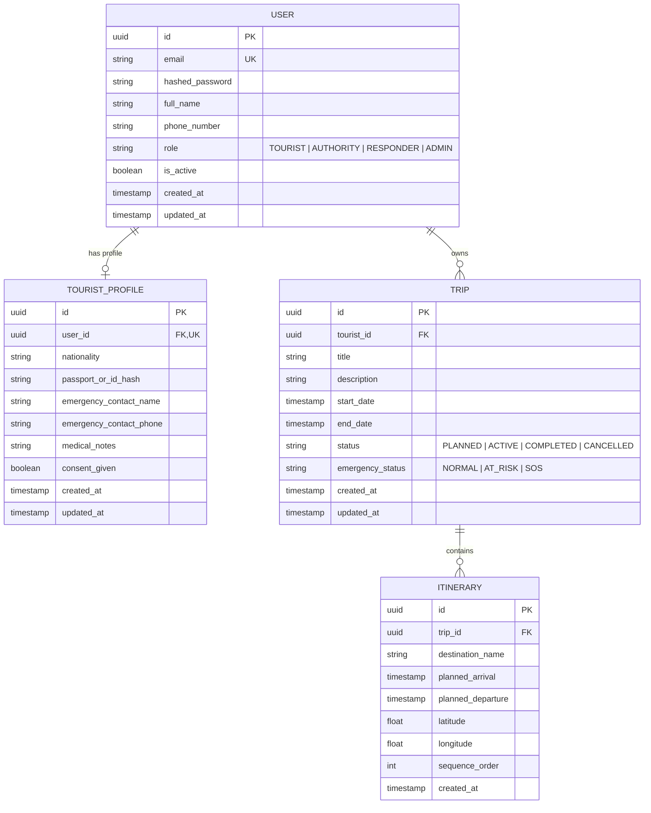

# System Design — KIROSHI v0.1

> Status: IMPLEMENTED (v0.1)

---

## 1. Domain Entities & Data Modeling

The core platform centers around four primary entities:

---

## 2. Component Boundaries & Responsibilities

### `backend/app/core/`
- `config.py`: Single source of truth for runtime settings (environment, secret keys, token TTLs, database URLs).
- `security.py`: Cryptographic routines (bcrypt password hashing, JWT encode/decode, token validation).
- `database.py`: SQLAlchemy engine, session maker, declarative base.
- `errors.py`: Domain-specific exceptions (`AppException`, `EntityNotFoundError`, `AuthorizationError`, `DuplicateResourceError`).
- `logging.py`: Structured logger configuration.

### `backend/app/domain/models/`
- Declarative SQLAlchemy models representing relational tables with explicit constraints, foreign keys, and indexes.

### `backend/app/schemas/`
- Pydantic models for incoming request validation and outgoing serialization.
- Separate schemas for Create, Update, and Read operations to prevent mass-assignment vulnerabilities.

### `backend/app/services/`
- **`AuthService`**: Authenticates credentials, validates unique emails, issues JWT bearer tokens.
- **`TouristService`**: Manages profile creation and retrieval, enforcing that tourists can only access their own profile while authorities can query authorized profiles.
- **`TripService`**: Manages trip lifecycles, ensures only the trip owner can start/stop their trip, and validates state transitions (`PLANNED` -> `ACTIVE` -> `COMPLETED`).

### `backend/app/api/v1/endpoints/`
- FastAPI route handlers with typed dependencies and HTTP status code mappings.
