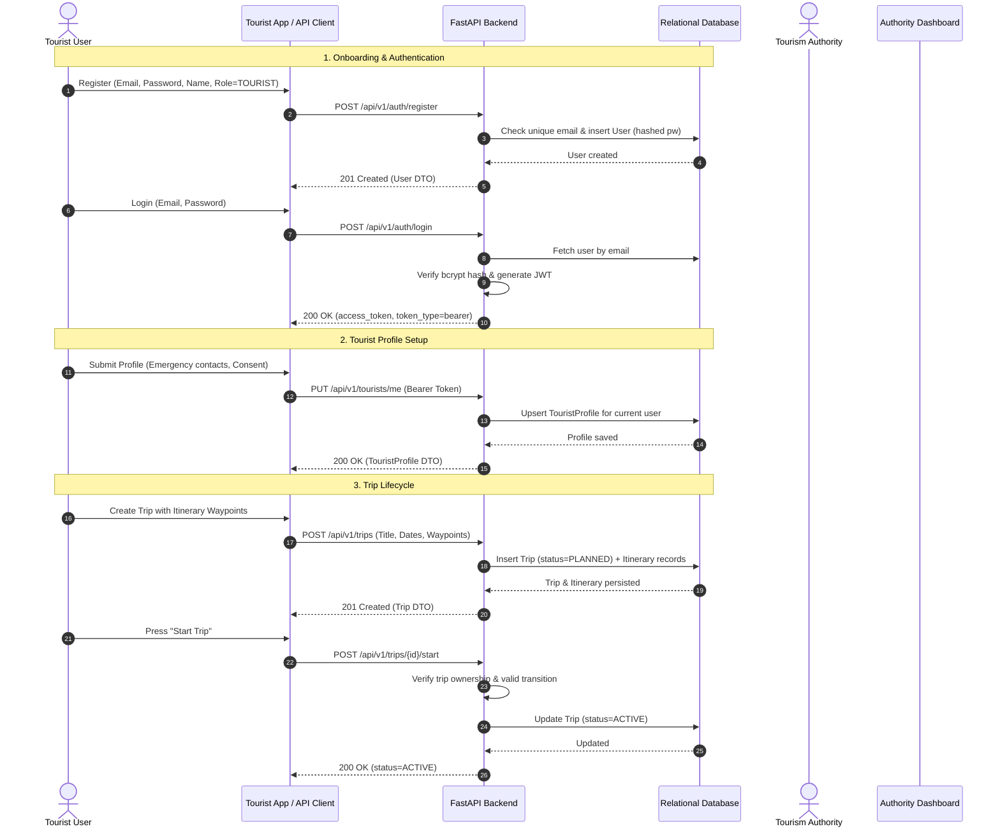
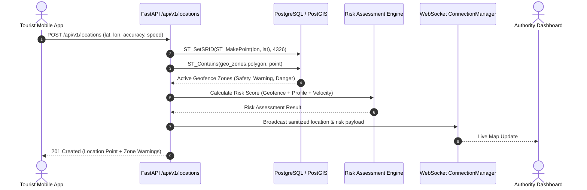
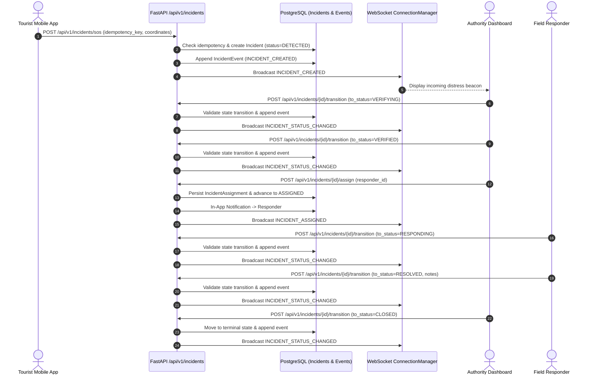

# System Flow — KIROSHI v0.7

> Status: IMPLEMENTED (v0.7 Advanced Audit & Trust)

---

## 1. Primary v0.1 Core Onboarding & Lifecycle



---

## 2. v0.2 Real-Time Geospatial & Geofencing Pipeline



---

## 3. v0.4 Emergency Response & Incident Lifecycle Pipeline



---

## 4. v0.7 Advanced Audit & Cryptographic Trust Pipeline

```mermaid
sequenceDiagram
    autonumber
    actor Actor as Authenticated User (Tourist / Responder / Admin)
    participant API as FastAPI Endpoint Layer
    participant Service as Business Domain Service
    participant AuditSvc as AuditService & Engine
    participant Hasher as AuditHasher (SHA-256)
    participant DB as PostgreSQL (audit_events Table)
    participant Verifier as AuditChainVerifier
    participant Anchor as TrustAnchor Adapter (Modular)

    Actor->>API: Sensitive Operation (Auth, SOS, Transition, Location Read, Export)
    API->>Service: Execute Domain Logic
    Service->>DB: Apply & Commit Business Mutation
    
    %% Audit Chaining Step
    Service->>AuditSvc: log_event(event_type, actor, resource, details)
    AuditSvc->>DB: Fetch Latest Event (get last event_hash & sequence_number)
    DB-->>AuditSvc: previous_hash (or GENESIS_HASH if seq #1)
    
    AuditSvc->>Hasher: calculate_event_hash(canonical_payload, previous_hash)
    Hasher->>Hasher: Sort keys, format ISO UTC timestamps, compute SHA-256
    Hasher-->>AuditSvc: event_hash
    
    AuditSvc->>DB: INSERT INTO audit_events (seq, type, actor_id, details, prev_hash, event_hash)
    DB-->>AuditSvc: Persisted
    AuditSvc-->>Service: Event recorded

    %% Verification & Trust Anchoring
    opt On-Demand Chain Verification (Admin/Auditor)
        Actor->>API: POST /api/v1/audit/verify
        API->>AuditSvc: verify_chain()
        AuditSvc->>DB: Query all AuditEvents ORDER BY sequence_number ASC
        DB-->>AuditSvc: Event Sequence
        AuditSvc->>Verifier: verify_chain(events)
        Verifier->>Verifier: Check genesis, forward pointers & payload digests
        Verifier-->>AuditSvc: ChainVerificationResult (CHAIN_VALID / CHAIN_BROKEN)
        AuditSvc-->>API: 200 OK (Verification Report)
    end

    opt Periodic Trust Checkpointing
        AuditSvc->>Anchor: anchor_checkpoint(sequence_number, event_hash)
        Anchor-->>AuditSvc: Checkpoint confirmation (Idempotent digest submission)
    end
```
