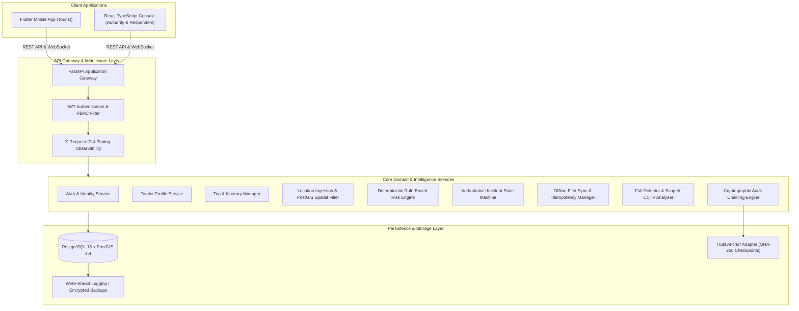
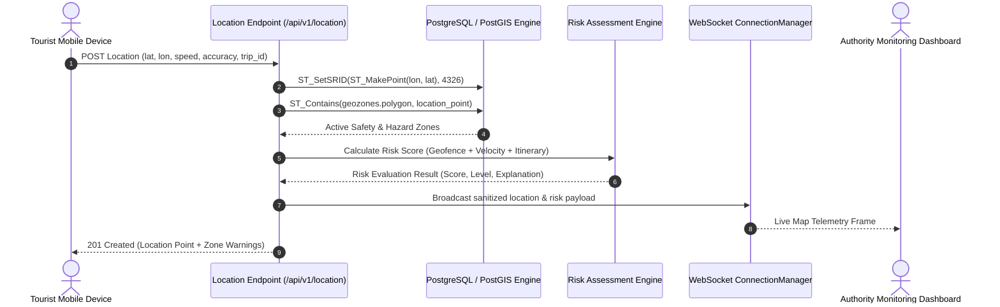
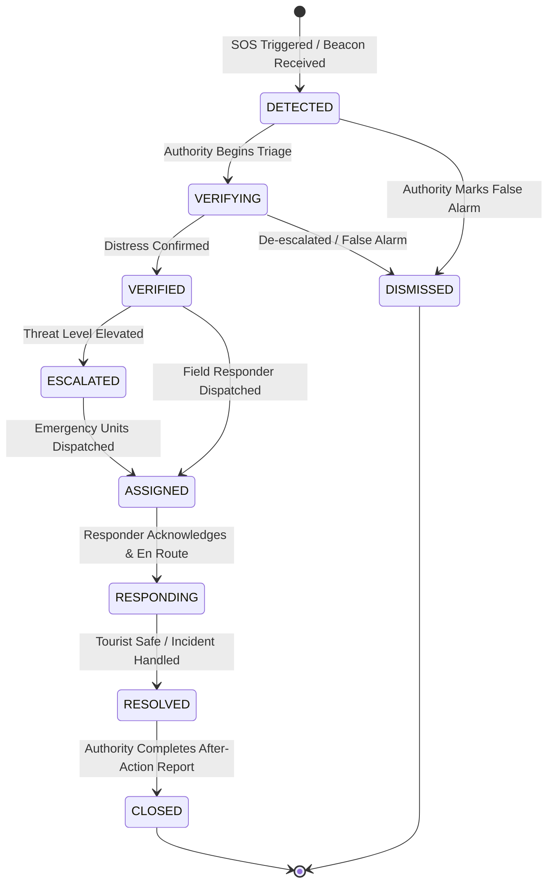
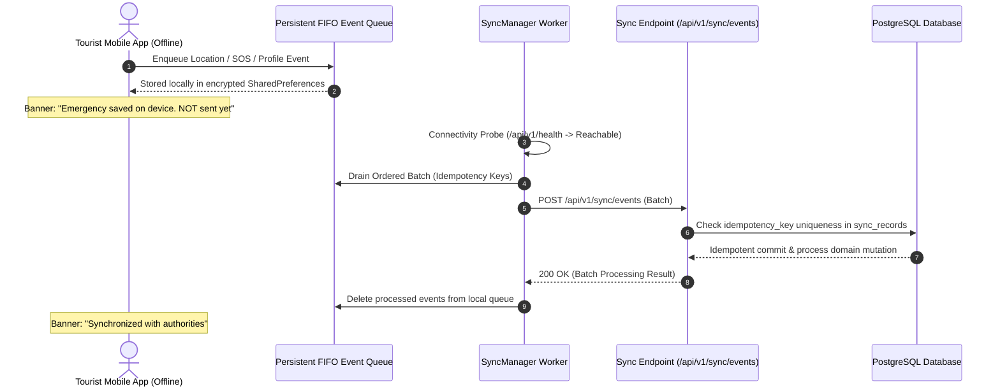

# KIROSHI System Architecture & Subsystem Flows (v1.0)

> Status: IMPLEMENTED (v1.0 Production Release)

---

## 1. High-Level System Architecture



---

## 2. Location Tracking & Geospatial Pipeline Flow



---

## 3. Explainable Risk Scoring Engine Pipeline Flow

```mermaid
graph LR
    subgraph Inputs ["Real-Time Telemetry Inputs"]
        GPS["GPS Position & Accuracy"]
        Waypoints["Itinerary Route Segments"]
        Zones["Active High-Risk / Restricted Geozones"]
        History["Movement Velocity & Inactivity History"]
        CV["Computer Vision (Possible Fall Signals)"]
    end

    subgraph SignalEvaluators ["Signal Evaluators (RiskConfig Policy)"]
        DevEval["Route Deviation Evaluator (0.35 weight)"]
        ZoneEval["Geozone Risk Evaluator (0.45 weight)"]
        InactEval["Inactivity Evaluator (0.25 weight)"]
        SpeedEval["Speed Dynamics Evaluator (0.15 weight)"]
        CVEval["CV Fall Signal Evaluator (0.30 weight)"]
    end

    subgraph DecisionEngine ["Deterministic Aggregator"]
        Weighting["Weighted Contribution Normalizer"]
        Thresholds["Threshold Classifier (SAFE / LOW / MED / HIGH / CRITICAL)"]
        Explainer["Natural Language Explanation Generator"]
    end

    Inputs --> SignalEvaluators
    SignalEvaluators --> Weighting --> Thresholds --> Explainer
```



---

## 4. Emergency Response & Incident Lifecycle State Machine



---

## 5. Offline-First Synchronization & Event Queue Flow



---

## 6. Cryptographic Audit Chaining & Trust Verification Flow

```mermaid
sequenceDiagram
    autonumber
    actor Actor as User / System Operation
    participant Service as Business Domain Service
    participant AuditSvc as AuditService
    participant Hasher as AuditHasher (SHA-256)
    participant DB as audit_events Table
    participant Verifier as AuditChainVerifier

    Actor->>Service: Execute Sensitive Operation (Auth, SOS, Transition, Export)
    Service->>DB: Commit Business Record
    Service->>AuditSvc: log_event(type, actor, resource, details)
    AuditSvc->>DB: Fetch Latest Sequence # and Event Hash
    DB-->>AuditSvc: previous_hash (or GENESIS_HASH if #1)
    AuditSvc->>Hasher: calculate_event_hash(canonical_payload, previous_hash)
    Hasher->>Hasher: Canonical JSON (sorted keys, ISO UTC timestamps) -> SHA-256
    Hasher-->>AuditSvc: event_hash
    AuditSvc->>DB: INSERT INTO audit_events
    
    opt Verification Check
        Actor->>Verifier: POST /api/v1/audit/verify
        Verifier->>DB: Query all events ORDER BY sequence_number ASC
        Verifier->>Verifier: Validate genesis root, forward pointers & payload digests
        Verifier-->>Actor: ChainVerificationResult (CHAIN_VALID / CHAIN_BROKEN at #N)
    end
```
