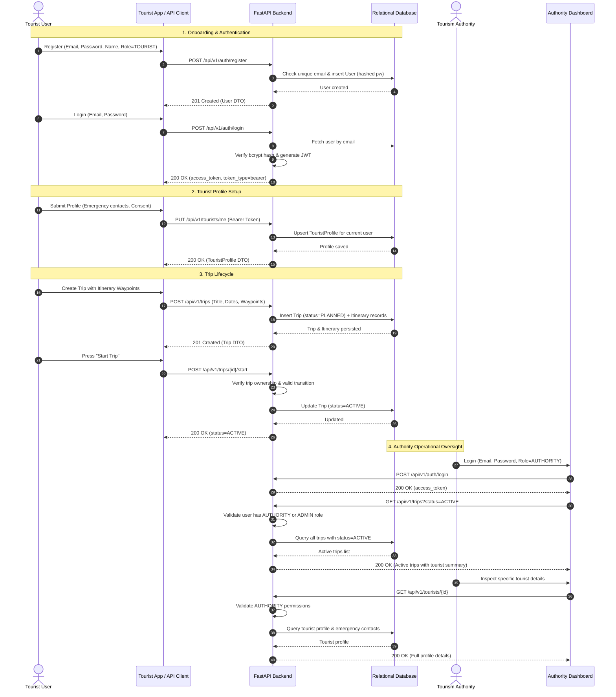

# System Flow — KIROSHI v0.1

> Status: IMPLEMENTED (v0.1)

---

## 1. Primary v0.1 End-to-End Workflow

The primary end-to-end flow connects the tourist onboarding lifecycle with authority operational oversight:

---

## 2. Error & Security Flow (Cross-User Isolation)

To verify robust server-side authorization:
- If **Tourist A** requests `GET /api/v1/tourists/{Tourist_B_id}`, the backend returns **403 Forbidden** (Role `TOURIST` is not permitted to query arbitrary user profiles).
- If **Tourist A** attempts `POST /api/v1/trips/{Tourist_B_trip_id}/start`, the backend returns **403 Forbidden** (Trip does not belong to the requesting user).
- If an unauthenticated client requests any protected resource without a valid Bearer token, the backend returns **401 Unauthorized**.
