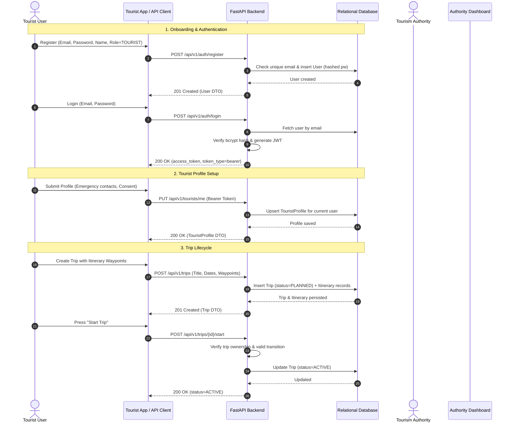
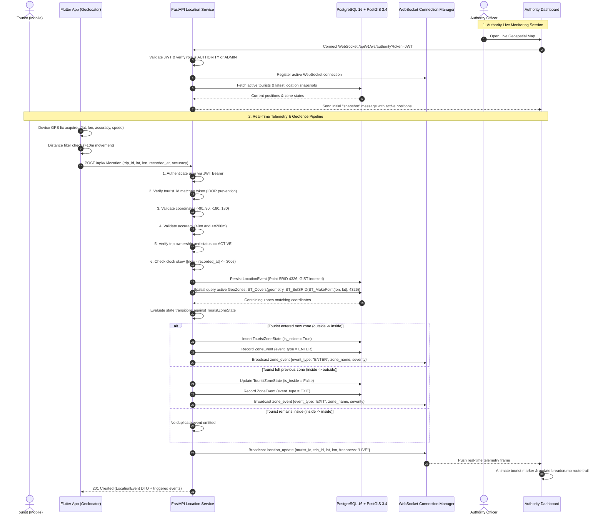
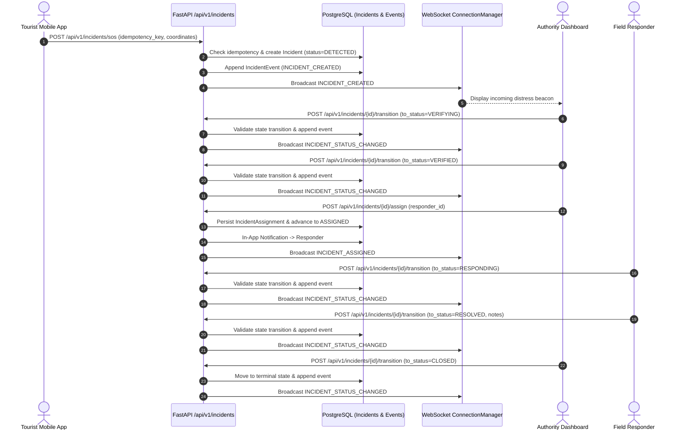

# System Flow — KIROSHI v0.2

> Status: IMPLEMENTED (v0.2)

---

## 1. Primary v0.1 Core Onboarding & Lifecycle

---

## 2. v0.2 Real-Time Geospatial & Geofencing Pipeline

The v0.2 architecture establishes real-time telemetry streaming from tourist mobile devices into PostGIS spatial storage, evaluates polygon containment, and fans out low-latency WebSockets to authority dashboards:

---

## 3. Geofence State Transition Truth Table

To eliminate alert spamming, the transition engine enforces strict edge-triggered events:

| Previous State | Current Containment | State Change? | Event Emitted | Audit Record Created |
|---|---|---|---|---|
| `OUTSIDE` (or none) | `INSIDE` | Yes | `ENTER` | Yes |
| `INSIDE` | `INSIDE` | No | *None* | No |
| `INSIDE` | `OUTSIDE` | Yes | `EXIT` | Yes |
| `OUTSIDE` | `OUTSIDE` | No | *None* | No |

---

## 4. Location Freshness Classification

Telemetry displayed on the Authority Dashboard is classified dynamically based on `recorded_at` relative to current server time:

| Freshness Level | Age Threshold | UI Visualization | Operational Status |
|---|---|---|---|
| **`LIVE`** | `< 60 seconds` | Emerald pulse marker | Active real-time tracking |
| **`RECENT`** | `60s – 300s (5 min)` | Blue marker | Normal GPS intermittent ping |
| **`STALE`** | `300s – 1800s (30 min)`| Amber warning marker | Possible signal loss or battery-saving |
| **`UNKNOWN`** | `> 1800s (30 min)` | Muted gray marker | Disconnected / Stale journey |

---

## 5. Security & Isolation Invariants

- **Token Bound**: `tourist_id` is never read from untrusted client payloads; it is strictly derived from the verified JWT `sub` claim.
- **Trip Isolation**: Location points cannot be recorded against trips owned by other tourists or trips not currently in `ACTIVE` state.
- **WebSocket RBAC**: WebSocket connections to `/api/v1/ws/authority` require valid authentication and are restricted to users with `AUTHORITY` or `ADMIN` roles. Unauthorized clients receive close code `1008 Policy Violation`.
- **Sanitized Telemetry**: WebSocket location frames broadcast minimal operational payloads (coordinates, accuracy, timestamp, trip ID) without broadcasting sensitive identity hashes or medical notes.

---

## 6. v0.4 Emergency Response & Incident Lifecycle Pipeline

