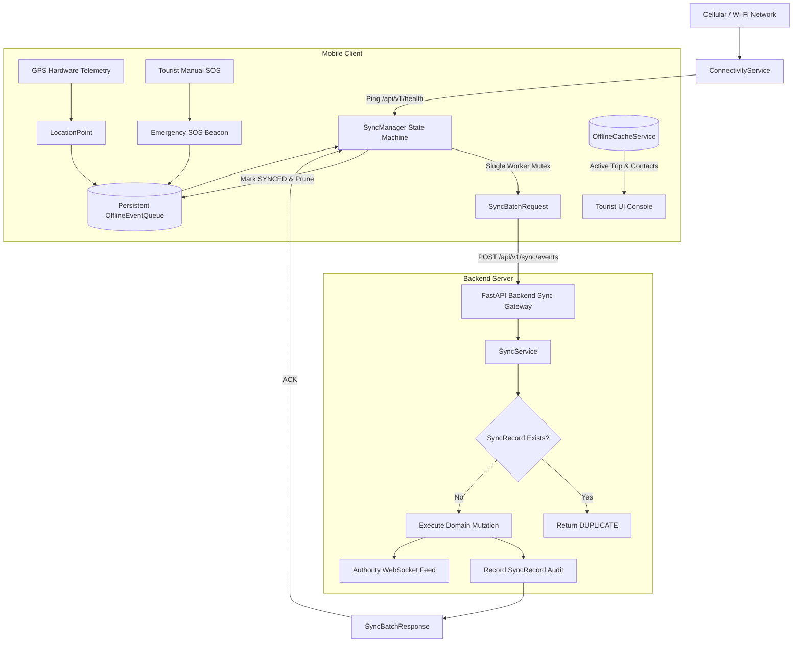
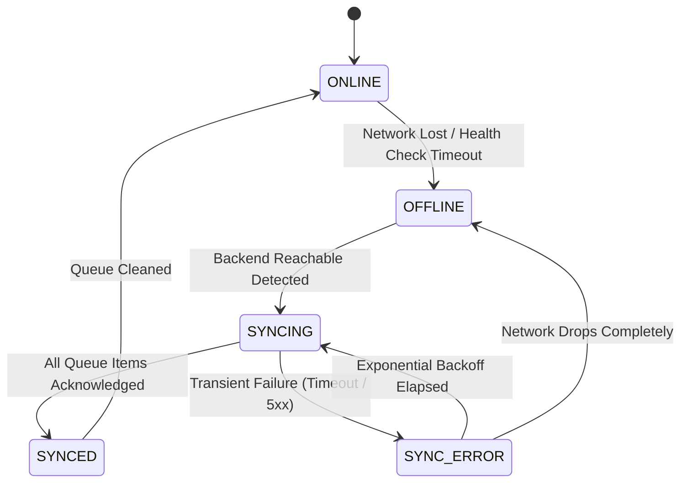
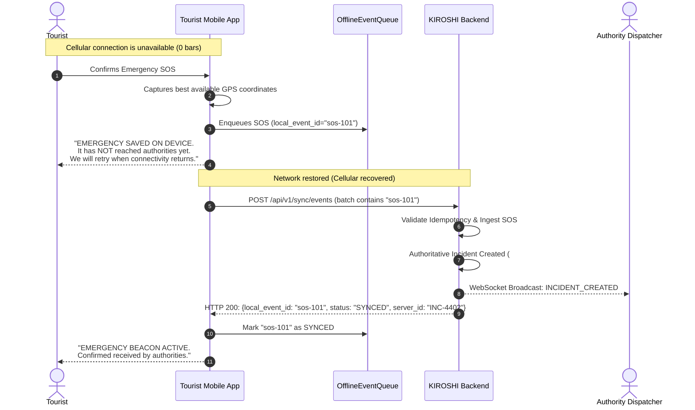
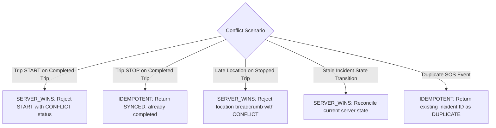

# KIROSHI v0.5 — Offline-First Safety & Synchronization

> **Document Version:** 1.0.0 (KIROSHI v0.5)  
> **Status:** IMPLEMENTED  
> **Module:** Mobile Client (`apps/mobile`) & Backend Sync Engine (`backend/app/services/sync_service.py`)

---

## 1. Overview & Core Philosophy

KIROSHI is built for life-critical tourist safety in challenging physical environments (remote trails, mountain ranges, coastal areas, national parks, and urban transit) where cellular connectivity is frequently unavailable or erratic.

In KIROSHI, **offline mode is NOT an application error** — it is a standard operational operating mode. The mobile application operates with full safety autonomy when disconnected and gracefully synchronizes telemetry, trip updates, and distress signals upon network recovery.

---

## 2. Architectural Design

The synchronization and persistence pipeline follows a unidirectional, decoupled flow:

---

## 3. Centralized Offline State Machine

The client tracks synchronization state through a unified state machine (`MobileSyncState`) managed by `SyncManager`, eliminating scattered boolean flags:

### State Definitions:
1. **`ONLINE`**: Full bidirectional connectivity to KIROSHI backend verified. Real-time telemetry streams directly.
2. **`OFFLINE`**: Backend unreachable. Local UI enters offline mode, reads cached trip info, and routes all telemetry and distress events to persistent queue.
3. **`SYNCING`**: Active synchronization in progress under a single-worker mutex lock.
4. **`SYNCED`**: All queued events have received server acknowledgement and local queue is clean.
5. **`SYNC_ERROR`**: Temporary network failure during sync. Controlled exponential backoff timer scheduled.

---

## 4. Local Persistence & Storage Classification

In compliance with project standards, KIROSHI extends existing dependencies (`shared_preferences` for structured JSON storage and `flutter_secure_storage` for credentials) rather than introducing unneeded database engines.

### Data Classification Table

| Data Element | Storage Location | Classification | Reason & Retention Policy |
| :--- | :--- | :--- | :--- |
| **Authentication Tokens** | Secure Storage (KeyStore/Keychain) | REQUIRED OFFLINE | Encrypted credentials required for automated sync upon reconnect. |
| **Current Active Trip** | SharedPreferences JSON | REQUIRED OFFLINE | Preserves tourist destination, itinerary sequence, and guidelines. |
| **Emergency Contacts** | SharedPreferences JSON | REQUIRED OFFLINE | Must be instantly viewable even without power or network. |
| **Last Known Location** | SharedPreferences JSON | REQUIRED OFFLINE | Single latest coordinates fix; minimizes privacy exposure. |
| **Offline Event Queue** | SharedPreferences JSON | REQUIRED OFFLINE | Persists pending beacons and telemetry; survives process kill. |
| **Historical Breadcrumb History** | Not Cached Locally | DO NOT CACHE | Prevents storage bloat and minimizes privacy exposure if device is lost. |
| **User Passwords** | Not Cached | DO NOT CACHE | Strict zero-storage security policy. |

---

## 5. Persistent Event Queue & Lifecycle

The `OfflineEventQueue` provides a thread-safe, FIFO storage queue surviving application crashes and restarts:

### Event Structure:
- `local_event_id`: Unique client UUID/nonce (`sos-{timestamp}-{random}` or `loc-{timestamp}-{random}`).
- `event_type`: `SOS_EVENT`, `LOCATION_EVENT`, `TRIP_UPDATE`, `INCIDENT_ACTION`.
- `payload`: Event-specific dictionary.
- `timestamp`: UTC hardware capture timestamp.
- `retry_count`: Incremented on transient sync failure.
- `status`: `pending` $\rightarrow$ `syncing` $\rightarrow$ `synced` $\rightarrow$ `failed`.

### Queue Capacity Management:
- Maximum queue capacity: **1,000 events**.
- If capacity is reached:
  1. Synced events are immediately purged.
  2. If still full, oldest non-critical `LOCATION_EVENT` breadcrumbs are pruned.
  3. **`SOS_EVENT` beacons are NEVER pruned under any circumstance.**

---

## 6. Offline SOS & The Critical Honesty Rule

### The Critical Honesty Rule:
> **A safety application must NEVER tell the tourist "Emergency sent" or imply authorities have been alerted unless the backend server has authoritatively acknowledged receipt of the incident.**

When offline, the client UI presents clear, unambiguous feedback:

### SOS State Machine:
1. `SOS_SAVED_LOCALLY`: Emergency persisted to device disk; NOT reached authorities.
2. `SOS_WAITING_FOR_CONNECTION`: Monitoring cellular reachability.
3. `SOS_SENDING`: HTTP payload in transit.
4. `SOS_SENT`: Server acknowledged receipt; authority incident active.
5. `SOS_SYNC_FAILED`: Unrecoverable error; displays manual emergency phone numbers.

---

## 7. Server-Side Idempotency & Conflict Resolution

### Idempotency Guarantee:
Every sync event carries a client-generated `local_event_id`. The backend enforces idempotency using the `sync_records` table:
- **First Submission**: Domain action executed $\rightarrow$ entity created $\rightarrow$ audit record stored in `sync_records` $\rightarrow$ returns `SYNCED`.
- **Replayed Submission**: Match found in `sync_records` $\rightarrow$ existing resource ID and response returned $\rightarrow$ returns `DUPLICATE`.
- **Result**: Zero duplicate incidents, zero duplicate transitions, zero corrupt states.

### Conflict Resolution Policies:

---

## 8. Battery & Radio Efficiency

- **Distance Filtering**: GPS telemetry relies on a 10-meter distance filter, preventing redundant polling while stationary.
- **Batch Aggregation**: Offline telemetry points are aggregated into a single HTTP POST batch (up to 50 events) upon reconnect, avoiding hundreds of radio wake-ups.
- **Bounded Exponential Backoff**: Retry intervals scale progressively ($2\text{s} \rightarrow 4\text{s} \rightarrow 8\text{s} \rightarrow 16\text{s} \rightarrow 30\text{s}$ max) to protect device battery when disconnected.
