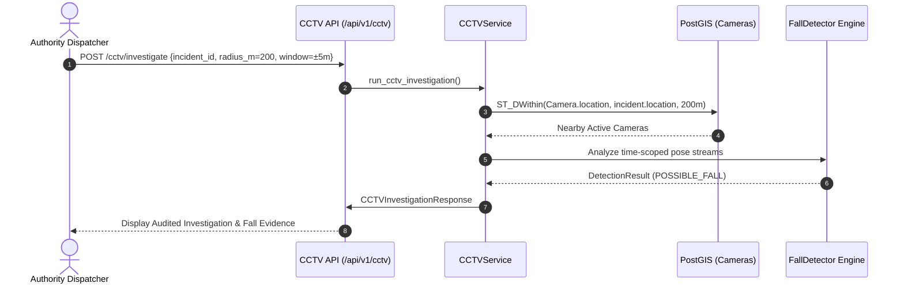

# Scoped CCTV Investigation Architecture (v0.6)

## Overview
KIROSHI v0.6 provides an authorized, spatially-indexed, and time-bounded CCTV investigation pipeline. It allows emergency response authorities to analyze local camera feeds surrounding distress incidents without conducting indiscriminate surveillance.

---

## Architecture & PostGIS Spatial Discovery

---

## Privacy by Design Guarantees
1. **Incident-Scoped**: Investigation requires an active `incident_id`.
2. **Location-Scoped**: Restricted strictly to cameras within `search_radius_meters` via PostGIS GIST indexes.
3. **Time-Scoped**: Footage extraction bounded to narrow temporal windows (e.g. $\pm 5$ minutes of distress timestamp).
4. **Role-Based Authorization**: Restricted to authenticated `AUTHORITY` and `ADMIN` roles.
5. **Tamper-Evident Audit Trail**: Every investigation query is permanently logged in the `cctv_investigations` table with actor, timestamp, radius, and results.
6. **No Mass Surveillance**: Facial recognition, biometric indexing, and indiscriminate tracking are strictly prohibited.
