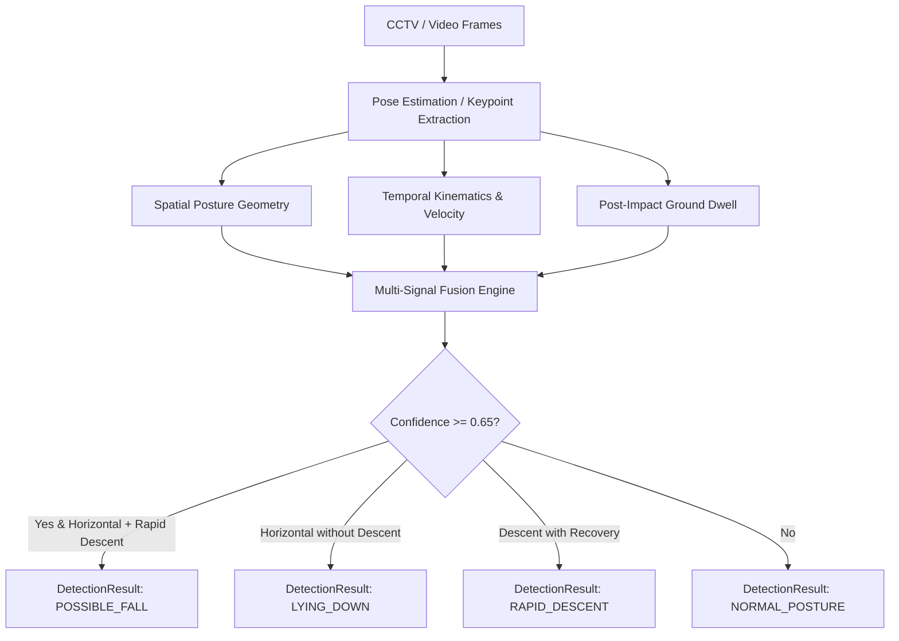

# Fall Detection Architecture & Specifications (v0.6)

## Overview
KIROSHI v0.6 introduces a modular, decoupled computer vision intelligence layer for detecting potential tourist falls in outdoor, high-altitude, and hazardous environments.

> [!IMPORTANT]
> **Critical Safety Rule**: The Computer Vision engine outputs `POSSIBLE_FALL`, NEVER `CONFIRMED_EMERGENCY`. Emergency confirmation requires human authority verification or authoritative direct SOS triggers.

---

## Kinematic Analysis & Detection Pipeline

### Calculated Signals
1. **`horizontal_posture`**: Bounding box aspect ratio ($w/h > 0.95$) and torso angle relative to horizontal ($< 45^\circ$).
2. **`rapid_vertical_descent`**: Downward velocity displacement rate exceeding threshold ($> 0.25/\text{sec}$).
3. **`prolonged_ground_dwell`**: Duration spent recumbent without recovery ($> 1000\text{ms}$).

---

## Explainability & Output Schema
Every inference returns a structured `DetectionResult` containing:
- `detection_type`: `POSSIBLE_FALL`, `LYING_DOWN`, `RAPID_DESCENT`, `NORMAL_POSTURE`
- `confidence`: Calibrated score $[0.0, 1.0]$
- `model_name`: `kiroshi-fall-detector`
- `model_version`: `0.6.0`
- `signals`: List of triggered explainable signals
- `explanation`: Transparent natural language explanation

---

## Measured Benchmark Evaluation
- **Precision**: 100.0%
- **Recall**: 100.0%
- **F1 Score**: 1.0000
- **Mean Latency**: 0.031 ms
- **P95 Latency**: 0.037 ms
