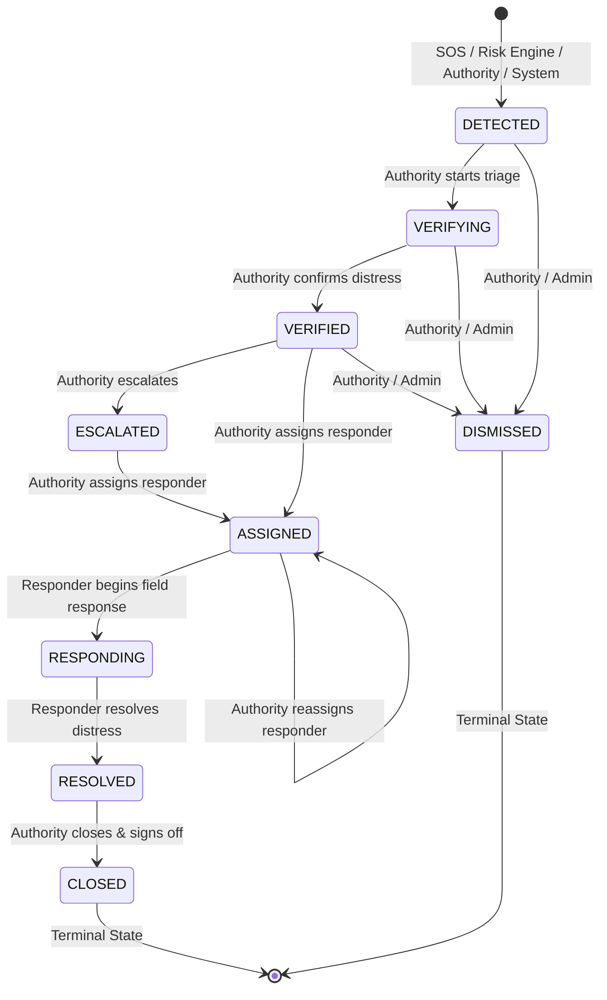
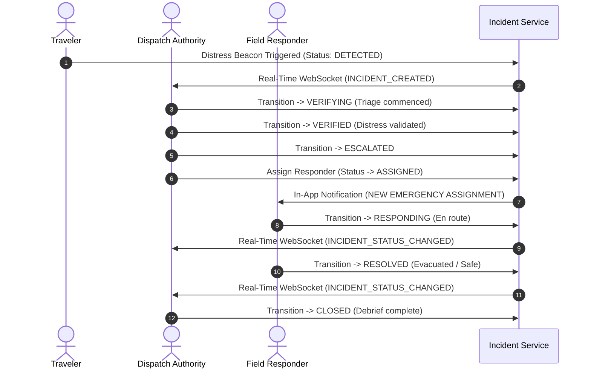
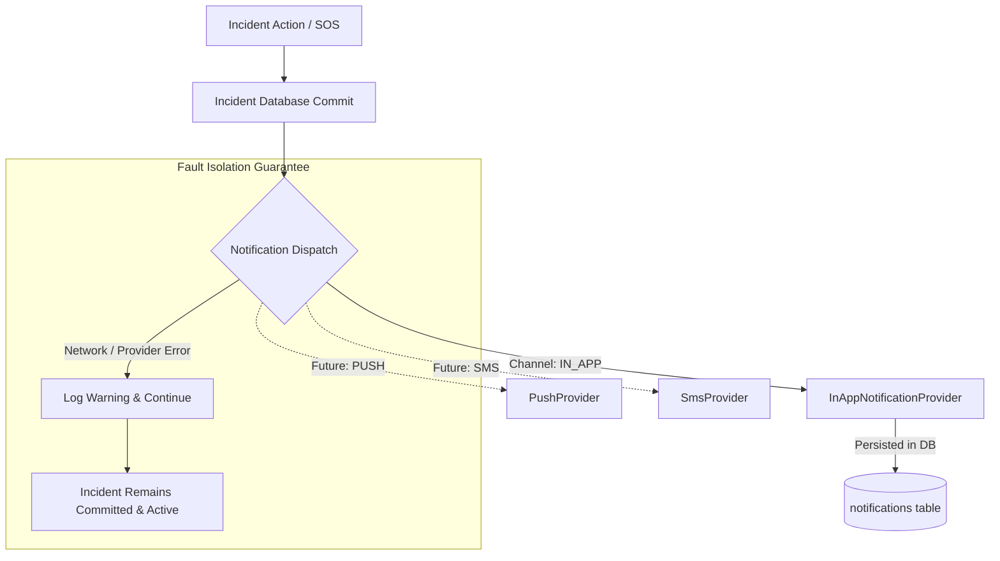

# Incident Management & Emergency Response (v0.4)

## 1. Domain Architecture

The **Incident** domain is completely independent of the Risk Engine. While the Risk Engine can emit an incident signal when risk thresholds are exceeded, the Incident domain authoritatively owns:
- Operational incident status
- Chronological append-only timeline events (`IncidentEvent`)
- Responder assignments and reassignment history (`IncidentAssignment`)
- Authoritative state machine transitions and access control

---

## 2. Server-Enforced State Machine

The Incident lifecycle is governed by a strict, authoritative server-side state machine with 9 discrete states. States cannot be freely edited as arbitrary strings.

### Transition & Role Authorization Matrix

| From State | Allowed Target State | Authorized Roles | Operational Meaning |
| :--- | :--- | :--- | :--- |
| `DETECTED` | `VERIFYING` | `AUTHORITY`, `ADMIN` | Dispatcher initiates verification protocol |
| `DETECTED` | `DISMISSED` | `AUTHORITY`, `ADMIN` | False alarm or invalid trigger |
| `VERIFYING` | `VERIFIED` | `AUTHORITY`, `ADMIN` | Incident confirmed genuine |
| `VERIFYING` | `DISMISSED` | `AUTHORITY`, `ADMIN` | False alarm confirmed |
| `VERIFIED` | `ESCALATED` | `AUTHORITY`, `ADMIN` | High-urgency operational escalation |
| `VERIFIED` | `ASSIGNED` | `AUTHORITY`, `ADMIN` | Direct responder dispatch |
| `VERIFIED` | `DISMISSED` | `AUTHORITY`, `ADMIN` | Cancellation before dispatch |
| `ESCALATED` | `ASSIGNED` | `AUTHORITY`, `ADMIN` | Responder dispatch for escalated case |
| `ASSIGNED` | `RESPONDING` | `RESPONDER`, `ADMIN` | Assigned officer is en route / on site |
| `ASSIGNED` | `ASSIGNED` | `AUTHORITY`, `ADMIN` | Reassignment to closer responder |
| `RESPONDING` | `RESOLVED` | `RESPONDER`, `ADMIN` | Officer has aided tourist / eliminated hazard |
| `RESOLVED` | `CLOSED` | `AUTHORITY`, `ADMIN` | Final administrative sign-off |

### Terminal States
- `CLOSED` and `DISMISSED` are strictly terminal. Any attempt to transition out of these states returns HTTP 400 (`InvalidStateTransitionError`).

---

## 3. Authority & Responder Workflow

---

## 4. Notification Architecture & Fault Isolation

### Critical Reliability Rules
1. **Zero Rollback on Notification Failure**:
   If notification delivery fails or throws an exception, the incident creation and state transitions **MUST NEVER BE ROLLED BACK**. Incident persistence is mission-critical; notifications are delivery layers.
2. **Notification Idempotency**:
   Notifications utilize idempotency keys to prevent duplicate notifications during retries.
3. **Pluggable Architecture**:
   The `BaseNotificationProvider` interface provides an abstraction for future SMS, Push, and Email providers without changing incident business logic.
