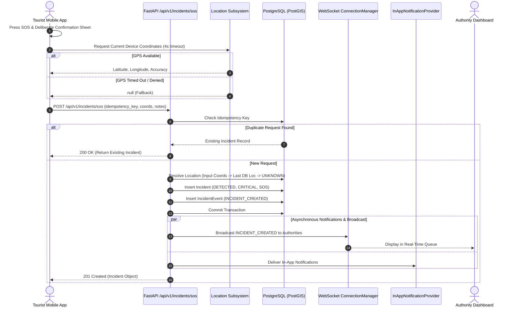

# Emergency SOS Architecture (v0.4)

## 1. Overview & Core Reliability Directive

The Emergency SOS system represents the primary panic and distress beacon mechanism for travelers using the KIROSHI platform.

### Critical SOS Reliability Rule
```
Authenticated Tourist
    ↓
SOS REST API (/api/v1/incidents/sos)
    ↓
Location Resolution (Fresh / DB Stale / UNKNOWN)
    ↓
Incident Database Persistence (Status: DETECTED, Severity: CRITICAL)
    ↓
Real-Time Authority WebSocket Broadcast & In-App Notifications
```

**MANDATORY ARCHITECTURAL DECOUPLING:**
If the following optional services or components fail or are unavailable:
- AI / Machine Learning services
- Risk Assessment Engine
- CCTV / Video feeds
- External SMS / Push / Email gateways
- Blockchain / Cryptographic audit networks

**THE SOS WORKFLOW MUST STILL SUCCEED AND PERSIST THE INCIDENT.**
Emergency distress beacons are life-critical paths that must execute independently of predictive intelligence or external networks.

---

## 2. Sequence Diagram



---

## 3. Location Capture & Resilience

The SOS workflow handles location gracefully across all edge scenarios:

| Sensor State | Freshness Classification | Database Representation | Behavior |
| :--- | :--- | :--- | :--- |
| Fresh GPS Fix (within 4s) | `LIVE` | Point geometry & lat/lng | Immediate geo-containment matching |
| Stale GPS Fix (&lt; 5 mins) | `RECENT` | Last known Point geometry | Flagged as recent telemetry |
| Stale GPS Fix (&gt; 5 mins) | `STALE` | Last known Point geometry | Flagged as stale telemetry |
| GPS Disabled / Denied / Underground | `UNKNOWN` | `NULL` geometry & lat/lng | **Incident created successfully** without coordinates |

**Under no circumstances will a GPS timeout or missing sensor reading block emergency incident persistence.**

---

## 4. Duplicate Suppression (Idempotency)

Under stressful emergency situations or poor cellular connectivity, tourists may tap the SOS button repeatedly or network clients may retry unacknowledged requests.

1. **Client-Generated Idempotency Key**:
   The tourist mobile client generates an idempotency key (format: `sos-<timestamp>-<rand>`) before initial dispatch.
2. **Server-Side Deduplication**:
   The server checks the `incidents.idempotency_key` unique constraint:
   - If an incident with the given key already exists in the database, the existing incident record is returned immediately with HTTP 200.
   - No duplicate incident row or redundant notification cascade is generated.

---

## 5. Offline SOS & The Critical Honesty Rule (v0.5)

In environments completely lacking cellular or Wi-Fi signal, KIROSHI introduces offline distress handling governed by the **Critical Honesty Rule**:

> **A safety system must never falsely reassure a user that emergency services have been alerted when the message has not left the device.**

### Offline Flow:
1. **Local Capture**: Hardware GPS coordinates (or fallback `UNKNOWN`), active trip ID, and distress notes are assembled into a local `SOS_EVENT`.
2. **Persistent Queueing**: The event is persisted to the local device storage (`OfflineEventQueue`). It survives application kills, operating system reboots, and crashes.
3. **Unmistakable Feedback**:
   - Status: `EMERGENCY SAVED ON DEVICE`.
   - Message: *"Emergency saved on this device. It has NOT reached authorities yet. We will retry when connectivity returns."*
4. **Automated Synchronization**: As soon as backend reachability is re-established, the single-worker `SyncManager` transmits the queued SOS to `POST /api/v1/sync/events`.
5. **Server Confirmation**: Only after receiving the server's HTTP 200 response with authoritative incident ID does the UI transition to `EMERGENCY BEACON ACTIVE`.

